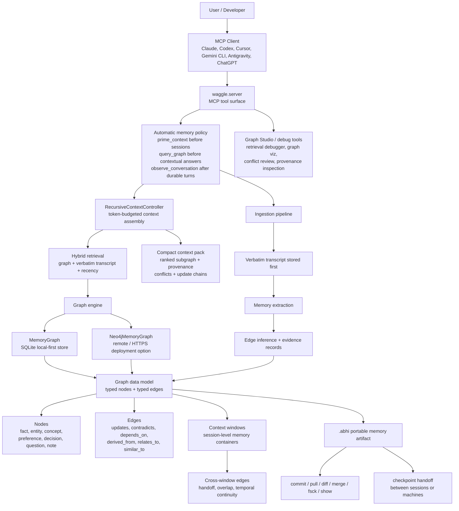

<p align="center">
  <strong>waggle-mcp</strong>
</p>

<p align="center">
  <strong>Persistent memory that remembers decisions, reasons, and contradictions across sessions.</strong><br/>
  Your AI forgets everything when the context window closes. Waggle gives it a graph-backed brain that persists.
</p>

<p align="center">
  <em>Not a code indexer. A conversational memory engine — it stores what you decided, why you decided it, and what changed, so the next session picks up where the last one left off.</em>
</p>

<p align="center">
  <a href="https://pypi.org/project/waggle-mcp"></a>
  
  
  
  
</p>

---

## Core

This repository is the public Waggle product repo: Apache-2.0 licensed, available on GitHub and PyPI, and focused on the local-first memory engine.

## Tech Stack

- Python 3.11+ package built with `pyproject.toml`
- MCP server exposed through `waggle-mcp`
- SQLite graph storage by default, with an optional Neo4j backend
- Local sentence-transformers embeddings with a deterministic offline fallback
- Ruff, mypy, and pytest for linting, type checks, formatting, and tests
- GitHub Actions for pull request CI/CD checks
- Vite/React assets for the bundled Graph Studio UI under `apps/mcp/graph-ui/`

---

## Quick Start

```bash
# Install globally (no venv needed)
pipx install waggle-mcp

# One-line setup — detects your MCP clients and writes config
waggle-mcp setup --yes

# Verify everything is healthy
waggle-mcp doctor
```

*(No `pipx`? Run `brew install pipx && pipx ensurepath` first.)*

`setup --yes` detects Claude Code, Codex, Cursor, Gemini CLI, and Antigravity, writes the MCP config, and installs automatic memory hooks where supported. Restart your client and you're live.

> **Windows users:** Run all commands with `python -X utf8` or set `PYTHONUTF8=1` to avoid `UnicodeEncodeError` from emoji in log output.

## Local Development Setup

These steps are intended to work on a clean macOS, Linux, or Windows checkout with Python 3.11+ and Git installed:

```bash
git clone https://github.com/Abhigyan-Shekhar/Waggle-mcp.git
cd Waggle-mcp
python -m venv .venv
source .venv/bin/activate      # macOS/Linux
# .venv\Scripts\activate       # Windows PowerShell
python -m pip install --upgrade pip
pip install -e ".[dev]"
WAGGLE_MODEL=deterministic pytest -q
ruff check src/ tests/
ruff format --check src/ tests/
```

Use `WAGGLE_MODEL=deterministic` for local verification so setup does not require downloading the embedding model.

## Install Waggle

Waggle is a local MCP server that gives coding agents persistent graph memory.

Recommended:

- VS Code: install the live `Waggle: Local Memory for AI Agents` extension from the Marketplace for one-click setup
- MCP clients: use [docs/install](./docs/install/README.md) and Smithery metadata in `smithery.yaml`
- Claude: use [docs/install/claude-code.md](./docs/install/claude-code.md) or [docs/install/claude-desktop.md](./docs/install/claude-desktop.md)
- Developers: `pipx install waggle-mcp`

Benchmark:

- LongMemEval 500-case retrieval-only: `97.4% R@5`, `89.0% Exact@5` for `graph_raw` retrieval

VS Code extension features:

- one-click `Enable for this Workspace` onboarding
- installs `waggle-mcp` with consent if it is missing
- safely creates or updates `.vscode/mcp.json`
- preserves existing non-Waggle MCP servers
- runs `waggle-mcp doctor`
- opens Graph Studio
- exports Waggle memory from the editor

Claude distribution:

- Claude Code does not use an `.mcpb` bundle. Users add Waggle directly as an MCP server:

```bash
pipx install waggle-mcp
claude mcp add --transport stdio waggle -- waggle-mcp serve --transport stdio
```

- Claude Desktop uses the `claude-desktop-extension.mcpb` bundle, which can be distributed through GitHub Releases.

Manual MCP config:

```json
{
  "mcpServers": {
    "waggle": {
      "command": "waggle-mcp",
      "args": ["serve", "--transport", "stdio"]
    }
  }
}
```

## Enterprise Evaluation

For self-hosted production review and security posture:

- [Production deployment guide](docs/deployment/production.md)
- [Security model](docs/security/security-model.md)
- [Hardening checklist](docs/security/hardening-checklist.md)
- [Reference](docs/reference.md)

## Contributing & Community

- [Contributing guide](./CONTRIBUTING.md)
- [Repository map](./docs/repository-map.md)
- [Starter issues](./docs/good-first-issues.md)
- [Label catalog](./.github/labels.yml)
- Contact channel: open a GitHub issue for bugs, feature proposals, and contributor assignment requests. Use `SECURITY.md` for vulnerability reports.

Contributor layout note:
- The repo root is reserved for packaging, deployment entrypoints, and external registry manifests. Contributor-facing docs, examples, and utilities should live under `docs/`, `examples/`, `scripts/`, or `deploy/`.

### Maintainer Tip

Repository labels are synced from [`.github/labels.yml`](./.github/labels.yml). To preview changes locally:

```bash
python3 scripts/sync_github_labels.py --repository Abhigyan-Shekhar/Waggle-mcp --dry-run
```

---

## 60-Second Demo

No MCP client needed. Run this from a fresh install:

```bash
waggle-mcp demo
```

This imports a pre-loaded example graph and runs 4 scripted queries locally — no API key, no network, no client required. Add `--with-embeddings` to use the real sentence-transformers model for higher-fidelity retrieval (requires ~420 MB download on first run).

---

## Why Waggle

`waggle-mcp` is a local-first memory layer for MCP-compatible AI clients, built on a persistent knowledge graph.

The core difference from flat note storage or chunked RAG is the graph structure. Waggle doesn't just store facts — it stores the relationships between them: this decision depends on that constraint, this preference contradicts that earlier one, this requirement was updated three sessions ago. When you query, you get a subgraph with the reasoning chain attached, not just the matching text.

| Without Waggle | With Waggle |
|---|---|
| Paste context into every session | Compact subgraph retrieved at query time |
| Session-local memory only | Persistent memory across all sessions |
| Flat notes, no structure | Typed nodes and edges: decisions, reasons, contradictions |
| "What changed?" requires replaying logs | Temporal queries, diffs, and conflict resolution are first-class |
| Contradictions silently overwrite history | Both positions preserved, contradiction edge explicit |

### What Is In Core Today

Waggle Core is the open-source local memory foundation:

- SQLite-backed graph memory
- MCP server integration
- CLI setup and doctor flows
- local embeddings or deterministic fallback
- graph querying, observation, and context priming
- import/export and graph inspection utilities

## Product Scope

This public repo is the product-facing Waggle surface:

- MCP server and tool surface
- local-first graph memory
- automatic memory hooks and orchestration
- `.abhi` export, import, diff, merge, and checkpoint handoff
- Graph Studio and admin tooling

Research artifacts, benchmark harnesses, evaluation reports, and paper material now live in the private `waggle-pro` repo.

---

## Architecture



---

## Recursive Context Assembly

Waggle stores memory outside the model context window. Instead of pasting long context into every prompt, agents call `build_context` to get a compact, high-signal context pack assembled from the graph.

Inspired by [Recursive Language Models](https://github.com/alexzhang13/rlm) — the idea of externalising long context into an environment and interacting with it through decomposition and targeted retrieval.

**How it works:**

1. **Decompose** — the query is split into targeted subqueries (decisions, constraints, implementation details, unfinished work, conflicts)
2. **Retrieve** — each subquery runs against graph, hybrid, and verbatim transcript retrieval
3. **Expand** — the graph is traversed around top nodes via typed edges (`updates`, `contradicts`, `depends_on`, `derived_from`)
4. **Resolve** — update chains and contradictions are detected; superseded nodes are flagged
5. **Deduplicate & rank** — overlapping hits are merged; high-signal node types (decisions, preferences) are boosted
6. **Compress** — everything is packed into a structured context brief under a configurable token budget

**Example MCP call:**

```json
{
  "tool": "build_context",
  "arguments": {
    "query": "Continue implementing Waggle from where we left off",
    "project": "waggle-mcp",
    "token_budget": 1000,
    "depth": 2
  }
}
```

**Example output:**

```
### Waggle Recursive Context Pack
Task: Continue implementing Waggle from where we left off

Current relevant decisions:
- [decision] Use SQLite for local storage: We chose SQLite with WAL mode for local-first deployments.
- [decision] Hybrid retrieval default: Hybrid (vector + BM25 + graph) is the default retrieval mode.

Active constraints:
- [preference] No external LLM APIs required: All retrieval must work fully local.

Important implementation context:
- [fact] RecursiveContextController added: New module waggle/recursive_context.py implements build_context.

Conflicts or superseded context:
- Possible conflict: 'Use Flask' contradicts 'Use FastAPI'
```

**Config env vars:**

| Variable | Default | Description |
|---|---|---|
| `WAGGLE_RECURSIVE_CONTEXT_ENABLED` | `true` | Enable/disable the feature |
| `WAGGLE_RECURSIVE_CONTEXT_DEFAULT_BUDGET` | `1200` | Default token budget |
| `WAGGLE_RECURSIVE_CONTEXT_MAX_SUBQUERIES` | `6` | Max decomposed subqueries |
| `WAGGLE_RECURSIVE_CONTEXT_DEFAULT_DEPTH` | `2` | Graph expansion depth |
| `WAGGLE_RECURSIVE_CONTEXT_INCLUDE_EVIDENCE` | `true` | Include transcript evidence |

**Tool aliases:** `recursive_context`, `assemble_context`, `rlm_context` all resolve to `build_context`.

---

## How It Works

```
User  → Agent → observe_conversation(...)  → Graph stores typed nodes + edges
User  → Agent → query_graph("database")   → Subgraph returned → Agent answers with linked rationale
```

**Session 1**
```
User:  Let's use PostgreSQL. MySQL replication has been painful.
Agent: [calls observe_conversation()]
       → stores decision node: "Chose PostgreSQL over MySQL"
       → stores reason node:   "MySQL replication painful"
       → links them with a depends_on edge
```

**Session 2** (fresh context window, no history)
```
User:  What did we decide about the database?
Agent: [calls query_graph("database decision")]
       → retrieves the decision node + linked reason from Session 1
       "You decided on PostgreSQL. The reason recorded was that MySQL replication had been painful."
```

**Session 3**
```
User:  Actually, let's reconsider — the team is more familiar with MySQL.
Agent: [calls store_node() + store_edge(new_node → old_node, "contradicts")]
       → both positions are preserved, and the contradiction is explicit
```

---

## Setting Up as an MCP Server

> **One-time install:** `pipx install waggle-mcp` — no API key, no cloud account, no Docker required for local use.

Shared JSON config for clients that accept `mcpServers` JSON:

```json
{
  "mcpServers": {
    "waggle": {
      "command": "waggle-mcp",
      "args": ["serve"],
      "env": {
        "WAGGLE_TRANSPORT": "stdio",
        "WAGGLE_BACKEND": "sqlite",
        "WAGGLE_DB_PATH": "~/.waggle/waggle.db",
        "WAGGLE_DEFAULT_TENANT_ID": "local-default",
        "WAGGLE_MODEL": "all-MiniLM-L6-v2",
        "WAGGLE_STARTUP_MODE": "normal"
      }
    }
  }
}
```

> First run takes ~30 s — `all-MiniLM-L6-v2` (~420 MB) downloads on first use.
> To skip the download: set `"WAGGLE_MODEL": "deterministic"` (offline-safe, instant start, slightly lower retrieval quality).

### Claude Desktop

Config file location:
- macOS: `~/Library/Application Support/Claude/claude_desktop_config.json`
- Windows: `%APPDATA%\Claude\claude_desktop_config.json`

Add the `mcpServers` block above.

### Claude Code

```bash
claude mcp add waggle \
  --env WAGGLE_TRANSPORT=stdio \
  --env WAGGLE_BACKEND=sqlite \
  --env WAGGLE_DB_PATH=~/.waggle/waggle.db \
  --env WAGGLE_DEFAULT_TENANT_ID=local-default \
  --env WAGGLE_MODEL=all-MiniLM-L6-v2 \
  -- waggle-mcp serve
```

Claude Code also supports **automatic memory hooks** — see the [Hooks](#automatic-memory-hooks-claude-code) section below.

### Codex

Add to `~/.codex/config.toml`:

```toml
[mcp_servers.waggle]
command = "waggle-mcp"
args    = ["serve"]
env     = {
  WAGGLE_TRANSPORT         = "stdio",
  WAGGLE_BACKEND           = "sqlite",
  WAGGLE_DB_PATH           = "~/.waggle/waggle.db",
  WAGGLE_DEFAULT_TENANT_ID = "local-default",
  WAGGLE_MODEL             = "all-MiniLM-L6-v2"
}
```

`waggle-mcp setup --yes` also writes a managed memory block into `AGENTS.md` in the current workspace so automatic memory is enabled by default for that repo.

### Gemini CLI

```bash
gemini mcp add waggle \
  -e WAGGLE_TRANSPORT=stdio \
  -e WAGGLE_BACKEND=sqlite \
  -e WAGGLE_DB_PATH=~/.waggle/waggle.db \
  -e WAGGLE_DEFAULT_TENANT_ID=local-default \
  -e WAGGLE_MODEL=all-MiniLM-L6-v2 \
  waggle-mcp serve
```

After restarting, run `/mcp` to confirm Waggle is connected.

### Cursor

`Cursor Settings → Features → MCP Servers → + Add`
- Command: `waggle-mcp`
- Args: `serve`
- Env vars: same keys as the JSON block above.

### Antigravity

The AI agent reads `~/.gemini/antigravity/mcp_config.json` (macOS/Linux) or `%USERPROFILE%\.gemini\antigravity\mcp_config.json` (Windows). Add the `waggle` block there. The VS Code extension panel reads a different file — adding waggle there will NOT make it available to the AI agent.

Run `waggle-mcp doctor` to see exactly which config files exist and which ones have a waggle entry.

### ChatGPT

ChatGPT custom MCP connectors require a remote HTTPS server. Deploy Waggle in HTTP mode with the Neo4j backend, expose `/mcp` over HTTPS, then add that URL as a custom connector in ChatGPT (`Settings → Connectors → Advanced → Developer mode`).

```bash
WAGGLE_TRANSPORT=http \
WAGGLE_BACKEND=neo4j \
WAGGLE_DEFAULT_TENANT_ID=workspace-default \
WAGGLE_NEO4J_URI=bolt://localhost:7687 \
WAGGLE_NEO4J_USERNAME=neo4j \
WAGGLE_NEO4J_PASSWORD=change-me \
waggle-mcp serve
```

Do not expose Waggle publicly without authentication.

### `waggle-mcp` not on PATH?

```bash
pipx ensurepath   # then restart your terminal
```

---

## Automatic Memory — Prompt Rules

Registering Waggle as an MCP server only makes the tools available. For the agent to call them automatically, add this instruction block to your client's prompt, rules, or project instructions:

```text
Use Waggle automatically for conversational memory.

At the start of a new session, if project, agent, or session scope is known, call prime_context.

Before answering questions that may depend on prior decisions, preferences, constraints, project state,
or earlier conversation context, call query_graph with the narrowest relevant scope.

After completed turns that contain durable information such as decisions, preferences, constraints,
requirements, user corrections, project facts, or meaningful task outcomes, call observe_conversation
automatically.

Waggle should remember relevant context automatically. If memory appears empty, the session is likely
missing the automatic memory policy or the runtime hooks that call build_context before answers and
on_assistant_turn after answers.

Do not ask the user to trigger Waggle manually. Use it in the background when relevant.
```

Use the same stable `project` value for the same codebase across sessions, or recall will fragment.

---

## Automatic Memory Hooks (Claude Code)

For Claude Code, `waggle-mcp setup --yes` installs three hook scripts that capture memory **deterministically** — no prompt rules needed:

| Hook script | Claude Code event | What it does |
|---|---|---|
| `pre_response.py` | `UserPromptSubmit` | Tries scoped DB recall first; if the scope is cold and a session checkpoint exists, imports the `.abhi` checkpoint and retries before Claude responds |
| `post_response.py` | `Stop` | Applies Waggle's durable-ingest policy and only calls `observe_conversation` for turns worth remembering |
| `pre_compact.py` | `PreCompact` | Calls `ingest_transcript_handoff` to preserve durable info before context compression, emit a session `.abhi` checkpoint, and refresh the checkpoint manifest |

Each hook always exits 0 (a Waggle bug never blocks your session) and has a 5-second timeout. `post_response.py` scans turn text for likely secrets before storing, skips low-value chatter, and only ingests durable turns.

```bash
# Install hooks (included in setup --yes)
waggle-mcp setup --yes

# Skip hook installation
waggle-mcp setup --yes --no-hooks

# Remove hooks
waggle-mcp uninstall-hooks
```

---

## Verify It Works

After restarting your client, ask the agent:

> *"Store a note: we're using PostgreSQL for this project."*

Then open a **fresh session** and ask:

> *"What database are we using?"*

Expected:
```
You're using PostgreSQL for this project.
```

---

## MCP Tool Reference

The full tool surface is large (~40 tools). In practice, an agent in normal use only needs the six core tools. Everything else is for human-driven inspection, graph management, and export workflows.

### Core tools — what the agent calls automatically

These are the tools your prompt rules or hooks should wire up. An agent that only knows these six will handle the vast majority of memory tasks correctly.

| Tool | When the agent calls it |
|---|---|
| `observe_conversation` | After any turn containing a decision, preference, constraint, correction, or project fact. Persists the verbatim turn first, then extracts graph nodes. Returns `turn_id`, `verbatim_stored`, `nodes_extracted`, `edges_inferred`. |
| `query_graph` | Before answering questions that may depend on prior context. Hybrid retrieval (graph + verbatim transcript) by default. Supports `as_of` for point-in-time queries. |
| `prime_context` | At the start of a new session to hydrate context from the most relevant scoped memories. |
| `graph_diff` | When the user asks what changed recently. |
| `store_node` + `store_edge` | When the agent needs to store a single atomic fact or explicitly link two nodes. Prefer `observe_conversation` for conversational turns — use these for structured, deliberate writes. |

> `observe_conversation` and `decompose_and_store` create edges automatically. If you only call `store_node`, you get isolated facts with no traversal value.

### Extended retrieval — agent-callable, situational

| Tool | Description |
|---|---|
| `aggregate_graph` | Broad filtered subgraph for map-reduce tasks. Use when you want a large scoped slice rather than high-precision top-K. Supports `node_types`, `tags`, `as_of`, `include_invalidated`. |
| `get_related` | Fetch the neighborhood around a specific node by ID. |
| `get_node_history` | Inspect a node's evidence, validity window, and connected context. |
| `get_topics` | Topic clusters via community detection across the full tenant graph. |
| `timeline` | Chronological view of memory changes for a node or query. |
| `list_conflicts` | List unresolved contradiction and update edges. |
| `resolve_conflict` | Mark a conflict resolved. Pass `winner` (node ID) to supersede the losing node — sets its `valid_to` to now. |

### Operator / human tools — not for routine agent use

These are for you as the operator: graph health, deduplication, export, and migration. Exposing all of these to an agent in normal use adds noise without benefit.

**Graph management**

| Tool | Description |
|---|---|
| `update_node` | Update an existing node's content, label, or tags. |
| `delete_node` | Delete a node and all its edges. |
| `decompose_and_store` | Break long content into atomic nodes and infer edges automatically. |
| `dedup_candidates` | Return near-duplicate node pairs above a similarity threshold for human review. |
| `canonicalize_node` | Merge multiple nodes into one canonical node. Repoints all edges, collects aliases. Idempotent. |
| `edge_quality_report` | Audit edge quality — counts, average confidence per type, top/bottom confidence edges. |
| `debug_retrieval` | Diagnose retrieval ranking for a query — embedding scores, window routing, tiered vs flat comparison. |

**Context windows**

| Tool | Description |
|---|---|
| `list_context_scopes` | Known agent, project, and session scope values. |
| `list_context_windows` | Chat/session-level memory containers with status and node counts. |
| `get_context_window` | Inspect one context window and its nodes. |
| `close_context_window` | Close a session window and derive cross-window edges. |
| `window_graph_viz` | Export the context-window graph as an interactive HTML visualization. |
| `export_graph_html` | Export the memory graph as an interactive HTML visualization. |
| `get_stats` | Node/edge counts, type breakdowns, and recent highly-connected nodes. |

**Memory files — git-vocabulary interface**

Waggle uses a git-inspired vocabulary for portable memory snapshots:

| Tool | Git analogy | Description |
|---|---|---|
| `commit` | `git commit` | Snapshot the graph to a `.abhi` file. Formats: `abhi` (default), `backup` (raw JSON), `bundle` (Markdown/JSON context pack). |
| `pull` | `git pull` | Load a `.abhi` or backup file into the current graph. Runs integrity verification before merging. |
| `diff` | `git diff` | Compare two `.abhi` files — added/removed/updated nodes and edges. |
| `merge` | `git merge` | Three-way merge two `.abhi` branches against a common base. Conflicts surface as `CONTRADICTS` edges. |
| `fsck` | `git fsck` | Validate a `.abhi` file without importing it. |
| `show` | `git show` | Inspect a `.abhi` file's summary stats without loading it. |
| `grep` | `git grep` | Execute a saved or ad hoc query against a `.abhi` file. |
| `load_abhi_chunks` | — | Load only selected or query-relevant chunks from a `.abhi` file. |

Legacy tool names (`export_graph_backup`, `import_abhi`, `diff_abhi`, `merge_abhi`, `validate_abhi`, `inspect_abhi`, `query_abhi`) are still accepted and automatically mapped to their canonical equivalents.

**Vault**

| Tool | Description |
|---|---|
| `export_markdown_vault` | Export the graph as an Obsidian-compatible Markdown vault. |
| `import_markdown_vault` | Import an edited Obsidian vault back into the graph non-destructively. |

---

## What To Ask The Agent

| Ask the agent... | Tool called |
|---|---|
| "Remember that..." | `observe_conversation` |
| "What do you know about X?" | `query_graph` |
| "What changed recently?" | `graph_diff` |
| "Summarize context for a new session" | `prime_context` |
| "Show all stored topics" | `get_topics` |
| "Export my memory to a file" | `commit` |
| "Are there any duplicate nodes?" | `dedup_candidates` |
| "What's the quality of my graph edges?" | `edge_quality_report` |

> **Edges are what make graph memory work.**
> `observe_conversation` and `decompose_and_store` create edges automatically.
> If you only call `store_node`, you get isolated facts — not a connected graph.

For broad summarization tasks, prefer `aggregate_graph` over `query_graph` when you want a large scoped slice of memory instead of high-precision semantic ranking.

---

## Graph Data Model

**Node types:** `fact`, `entity`, `concept`, `preference`, `decision`, `question`, `note`

**Edge types:** `relates_to`, `contradicts`, `depends_on`, `part_of`, `updates`, `derived_from`, `similar_to`

**Temporal validity:** Every node supports `valid_from` and `valid_to` fields. `query_graph` and `aggregate_graph` exclude expired nodes by default. Pass `include_invalidated: true` to include them, or `as_of: "<ISO-8601 datetime>"` to query the graph at a specific point in time. `resolve_conflict` with a `winner` node ID automatically sets the losing node's `valid_to` to now.

---

## Cross-Client Handoffs & Migration

### Same machine — automatic sharing

Point multiple clients at the same `WAGGLE_DB_PATH` (default `~/.waggle/waggle.db`) and they share one brain automatically.

### Session handoffs

```bash
# Explicit checkpoint before switching sessions or apps
waggle-mcp checkpoint-context --project MCP --session-id thread-123 --output ./handoff.abhi
```

Resume order is:
- same machine / shared `WAGGLE_DB_PATH`: use the live SQLite memory first
- if that scoped DB recall is empty: import the session `.abhi` checkpoint
- different machine or explicit transfer: `waggle-mcp pull ./handoff.abhi`

### Full migration

```bash
# Export
waggle-mcp export-graph-backup --output-path my_memory.json

# Import on new machine
waggle-mcp import-graph-backup --input-path my_memory.json
```

---

## CLI Command Reference

| Command | Description |
|---|---|
| `waggle-mcp --help` | Show all commands and options. |
| `waggle-mcp features` | Best first command — tool map, workflows, and setup hints. |
| `waggle-mcp doctor` | Run this if something isn't working — checks config, model cache, DB path. |
| `waggle-mcp doctor --fix` | Re-embed stale rows after a `WAGGLE_MODEL` change. |
| `waggle-mcp setup --yes` | Non-interactive one-line setup for all detected clients. |
| `waggle-mcp init` | Interactive setup wizard for one client. |
| `waggle-mcp serve` | Run the MCP server (usually started by your client). |
| `waggle-mcp demo` | Run the 60-second local demo with a pre-loaded example graph. |
| `waggle-mcp edit-graph` | Launch Graph Studio in the browser. |
| `waggle-mcp uninstall-hooks` | Remove the waggle-managed hooks block from Claude Code settings. |
| `waggle-mcp export-context-bundle` | Export a portable Markdown/JSON context pack. |
| `waggle-mcp export-markdown-vault` | Export the graph as an Obsidian-style vault. |
| `waggle-mcp ingest-transcript-handoff` | Ingest a rollover transcript, export a handoff bundle, and emit a session `.abhi` checkpoint. |

### `WAGGLE_STARTUP_MODE`

| Value | Behaviour | Best for |
|---|---|---|
| `normal` *(default)* | Model loads in background; server responds immediately | Daily use |
| `fast` | ML never loads; semantic tools return `unavailable` | Schema inspection, tool listing |
| `strict` | Server blocks until model is fully loaded | Production deployments |

---

## Graph Studio

```bash
waggle-mcp edit-graph
```

A local browser-based graph editor for inspecting and editing memory directly. Features:

- Dual-layer graph/conversation views in the same UI
- Transcript provenance and retrieval-debug inspection for hybrid memory results
- Mouse-based node dragging and shift-drag edge creation
- Collapsible side panels, focus mode, and label toggling for large graphs
- Live graph stats: connected nodes, isolates, cluster count
- Export/import of the current graph, including `.abhi` preview, diff, and sharing workflows

`.abhi` files are JSON underneath — they support optional embedded vectors, optional AES-256-GCM encryption, deterministic content hashing, and a magic-bytes header (`WGL\x01`) for format identification. Legacy bare-ZIP files are read transparently.

`waggle-mcp push` encrypts `.abhi` exports by default. Export paths refuse to proceed if transcript text contains likely secrets unless you pass `--force`.

---

## Model Support

Waggle uses a local `sentence-transformers` model selected by `WAGGLE_MODEL`.

- Default: `all-MiniLM-L6-v2`
- Any locally available `sentence-transformers` model name works.
- If the model is unavailable, Waggle falls back to deterministic SHA-256 embeddings.

```bash
WAGGLE_MODEL=all-mpnet-base-v2 waggle-mcp serve
```

For existing DBs, a model change is a migration event: run `waggle-mcp doctor`, then `waggle-mcp doctor --fix` if mixed `embedding_model_id` values are reported.

### `WAGGLE_DEDUP_THRESHOLD`

Controls the cosine similarity threshold for automatic node deduplication at write time (default `0.88`, minimum `0.85`). Nodes above this threshold with matching type and scope are merged automatically. Use `dedup_candidates` to review near-duplicates below the auto-merge threshold.

---

## Security & Privacy

- Data stays local by default (`~/.waggle/waggle.db`). No telemetry, no cloud calls for local operation.
- Memory only leaves your machine if you configure a remote backend or explicitly export/push.
- Local SQLite is not encrypted at rest — use OS disk encryption if the stored history is sensitive.
- Before `.abhi` export, Waggle scans transcript text for likely secrets (API keys, JWTs, passwords). Export is refused if secrets are found unless you pass `--force`.
- `waggle-mcp push` defaults to AES-256-GCM encrypted export.

---

## Known Limitations

- **Edges are load-bearing.** `observe_conversation` and `decompose_and_store` create them automatically. Raw `store_node` calls without follow-up edges produce disconnected nodes with no traversal value.
- **Graph retrieval trades tokens for reasoning context.** Factual lookups are often cheaper than chunked RAG; graph-expansion queries intentionally spend more tokens to carry update chains and contradictions.
- **Hybrid rerank is not the default.** The no-rerank hybrid path is stronger right now. The rerank path is available but intentionally not the launch default.
- **Deduplication is similarity-based, not universal semantic equivalence.** Broader production text may still require additional aliases or stricter domain guards.

---

## Troubleshooting

Run `waggle-mcp doctor` first — it usually identifies the actual failure mode.

### Diagnostics

- `waggle-mcp doctor`
- `waggle-mcp doctor --fix`
- `which waggle-mcp`
- `python3 -m pip show waggle-mcp`
- `env | grep WAGGLE`
- `lsof -i :8080`
- `sqlite3 "$WAGGLE_DB_PATH" "PRAGMA integrity_check;"`

### Common failure modes

**Missing `waggle` module**
- Cause: the package is not installed in the active Python environment.
- Fix: install from the repo root with `pip install -e ".[dev]"` and confirm `which python` points at the activated venv.

**Slow first start / stuck on loading model**
- Cause: `all-MiniLM-L6-v2` downloads on first use (~420 MB).
- Fix: wait for the one-time model download, or use `WAGGLE_MODEL=deterministic` for instant offline startup.

**`OSError: [Errno 98] Address already in use`**
- Cause: port `8080` or the configured `WAGGLE_HTTP_PORT` is already bound.
- Fix: run `WAGGLE_HTTP_PORT=18080 waggle-mcp serve` or stop the conflicting process.

**`sqlite3.OperationalError: database is locked`**
- Cause: another Waggle process holds the SQLite write lock.
- Fix: ensure only one server is running and remove any stale lock file at the configured DB path.

**`AuthenticationError: Invalid API key`**
- Cause: HTTP transport requires a valid API key header.
- Fix: send `X-API-Key: <your_key>` and generate one with `waggle-mcp keys create`; see `docs/reference.md`.

**Client cannot see tools**
- Cause: the client is not connected to the correct MCP server.
- Fix: verify the client config points to `waggle-mcp serve --transport stdio`, restart the client, and confirm the MCP entry is enabled.

**Database path permissions**
- Cause: the configured database path is not writable.
- Fix: set `WAGGLE_DB_PATH` to a writable location and rerun `waggle-mcp doctor`.

**Mixed embedding model IDs after model change**
- Cause: an existing database was created with a different embedding model.
- Fix: run `waggle-mcp doctor` and then `waggle-mcp doctor --fix` if mixed `embedding_model_id` values are reported.

---

## Reference & Docs

- **Environment variables, full tool surface, admin commands, Docker setup:** `waggle-mcp --help` or `docs/reference.md`
- **Production deployment:** `deploy/kubernetes/README.md`
- **Operations and troubleshooting:** `docs/install/troubleshooting.md`
- **Automatic memory rules (copy-pasteable):** `docs/automatic-memory-rules.md`
- **Hook integration details:** `docs/hooks.md`
- **.abhi format spec:** `docs/abhi-format-v2.md`

---

## Contributing

This repository is maintained privately. Internal contributors can use the docs in this repo as the source of truth.
