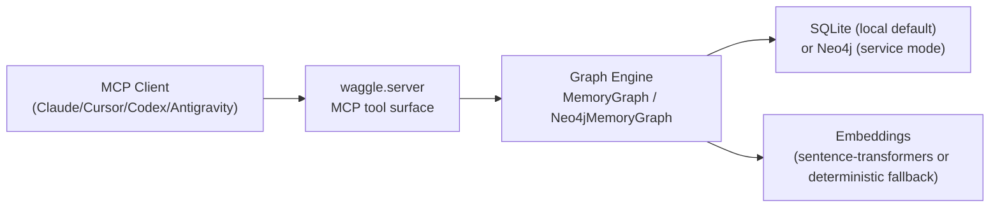
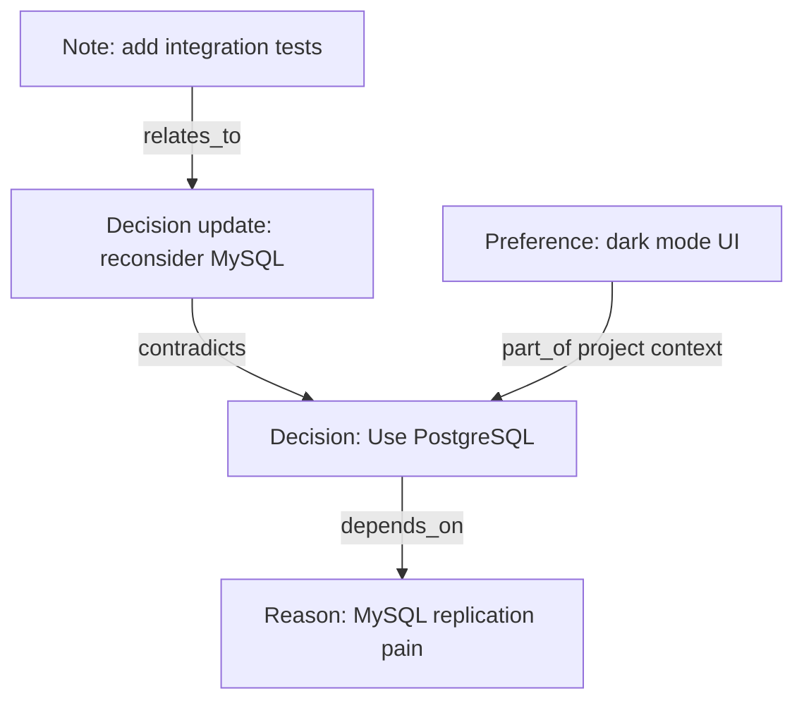

<p align="center">
  
</p>

<!-- mcp-name: io.github.Abhigyan-Shekhar/Waggle-mcp -->

<p align="center">
  <strong>Your AI forgets everything between sessions. Waggle gives it a graph-backed brain.</strong><br/>
  Persistent, structured memory for AI agents — typically lower-token than chunk-based retrieval, often 2-4× on factual lookups.
</p>

<p align="center">
  <em>Waggle is not a code indexer. It's a conversational memory engine — it remembers what you decided, why, and what changed, across every session.</em>
</p>

<p align="center">
  <a href="https://pypi.org/project/waggle-mcp"></a>
  
  
  
  
</p>

<p align="center">
  <a href="https://glama.ai/mcp/servers/Abhigyan-Shekhar/Waggle-mcp"></a>
  <a href="https://glama.ai/mcp/servers/Abhigyan-Shekhar/Waggle-mcp"></a>
</p>

---

## What's New — v0.1.9

- **Rollover transcript handoff CLI**: `waggle-mcp ingest-transcript-handoff` ingests full ordered transcripts, deduplicates them with `message_identity`, and exports a session-scoped handoff bundle for the next window or IDE.
- **Cross-run completion fixes**: append-only reruns now avoid reprocessing already completed turns while still completing a previously trailing `user` block when the matching `assistant` arrives later.
- **Evidence alignment fixes**: batch-ingested nodes now keep evidence turn indices aligned with the actual stored transcript rows, including tool/system-interleaved sessions.
- **Export error contract hardening**: handoff export failures now surface as real CLI failures instead of being silently downgraded into `export_skipped`.
- **Benchmark harness**: end-to-end `WaggleAdapter` connecting the graph engine to ConvoMem / MemBench runners with automated exact-match scoring and latency logging.
- **LongMemEval integration**: CLI-driven retrieval evaluation against the official LongMemEval split (`97.4% R@5` / `88.2% Exact@5` in `graph_raw`, `96.4%` / `85.6%` in `graph_hybrid`).
- **Observability stack**: Grafana dashboard, Prometheus config, and Docker Compose overlay in `deploy/observability/`.
- **Operational runbooks**: incident response, secret management, API-key rotation, and onboarding guides added to `docs/runbooks/`.

---

## Who is this for?

**→ Individual developer** extending Claude, Codex, Cursor, or Antigravity with persistent memory:
Use Python 3.11+ and install via `pipx` (no venv activation needed):
`brew install pipx && pipx ensurepath && pipx install waggle-mcp && waggle-mcp init`.
SQLite + local embeddings, zero infra.

**→ Team running a shared memory service:** Waggle ships with a Docker image, Kubernetes manifests, Prometheus metrics, and multi-tenant auth. See [deploy/kubernetes/](./deploy/kubernetes/) and [docs/runbooks/](./docs/runbooks/).

Both paths share the same MCP tool surface — the difference is only the backend and transport.

---

## Why waggle-mcp?

`waggle-mcp` is a local-first memory layer for MCP-compatible AI clients, built on a persistent knowledge graph.

| Stuffed context | Structured retrieval |
|-----------------|----------------------|
| Huge prompts every session | Compact subgraph retrieved at query time |
| Session-local memory | Persistent multi-session memory |
| Flat notes and chunks | Typed nodes and edges: decisions, reasons, contradictions |
| "What changed?" requires replaying logs | Temporal queries and diffs are first-class |

Waggle often uses materially fewer tokens than naive chunked retrieval on factual lookups, while graph-traversal queries intentionally spend more context to include reasoning chains such as updates, contradictions, and dependencies.

---

## Architecture



---

## Quick start (Recommended)

The simplest way to use Waggle is via `pipx`. This installs the package in an isolated environment and makes the `waggle-mcp` command available globally **without needing to manage a virtual environment (`.venv`) manually**.

```bash
# 1. Install waggle globally
pipx install waggle-mcp

# 2. Run the interactive setup
waggle-mcp init
```
*(If you don't have `pipx`, install it via `brew install pipx && pipx ensurepath`.)*

Running `init` will detect your MCP client (Codex, Claude, Cursor, or Antigravity), write the necessary configuration, and initialize your local database. Restart your client, and you're ready to go.

For Codex, `waggle-mcp init` also writes a managed Waggle block into `AGENTS.md` in the current workspace so automatic memory is enabled by default for that repo.

Manual MCP setup examples for **Codex**, **Claude Code**, **Cursor**, and **Antigravity** are in [docs/reference.md](./docs/reference.md#manual-client-configuration).

Comprehensive live feature run (full tool surface, multi-query graph tests, export/import validation):
[`tests/artifacts/test-run/comprehensive_feature_demo.md`](./tests/artifacts/test-run/comprehensive_feature_demo.md)

> **⚠️ Edges are what make graph memory work.**
> `observe_conversation` and `decompose_and_store` create edges automatically.
> If you only call `store_node`, you get isolated facts — not a connected graph.
> Always prefer `observe_conversation` for conversational ingestion.

---

## Setting Up waggle as an MCP Server

> **One-time install:** `pipx install waggle-mcp` (requires Python 3.11+; recommended on macOS/Homebrew Python) — no API key, no cloud account, no Docker required for local use.

Use this shared JSON config shape for clients that accept `mcpServers` JSON (recommended when installed via `pipx`):

```json
{
  "mcpServers": {
    "waggle": {
      "command": "waggle-mcp",
      "args": ["serve"],
      "env": {
        "WAGGLE_TRANSPORT": "stdio",
        "WAGGLE_BACKEND": "sqlite",
        "WAGGLE_DB_PATH": "~/.waggle/memory.db",
        "WAGGLE_DEFAULT_TENANT_ID": "local-default",
        "WAGGLE_MODEL": "all-MiniLM-L6-v2"
      }
    }
  }
}
```

<details>
<summary>Claude Desktop / Antigravity / Cursor / Claude Code setup details</summary>

**Claude Desktop config file location**
- macOS: `~/Library/Application Support/Claude/claude_desktop_config.json`
- Windows: `%APPDATA%\Claude\claude_desktop_config.json`

**Antigravity**
- Open agent panel → `···` → **Manage MCP Servers** → **View raw config**
- Paste the same JSON block above.

**Cursor**
- `Cursor Settings -> Features -> MCP Servers -> + Add`
- Command: `waggle-mcp`
- Args: `serve`
- Env vars: same keys as the JSON block above.

**Claude Code**
```bash
claude mcp add waggle \
  --env WAGGLE_TRANSPORT=stdio \
  --env WAGGLE_BACKEND=sqlite \
  --env WAGGLE_DB_PATH=~/.waggle/memory.db \
  --env WAGGLE_DEFAULT_TENANT_ID=local-default \
  --env WAGGLE_MODEL=all-MiniLM-L6-v2 \
  -- waggle-mcp serve
```

</details>

### Codex

Add to `~/.codex/config.toml`:

```toml
[mcp_servers.waggle]
command = "waggle-mcp"
args    = ["serve"]
env     = {
  WAGGLE_TRANSPORT         = "stdio",
  WAGGLE_BACKEND           = "sqlite",
  WAGGLE_DB_PATH           = "~/.waggle/memory.db",
  WAGGLE_DEFAULT_TENANT_ID = "local-default",
  WAGGLE_MODEL             = "all-MiniLM-L6-v2"
}
```

A live-source development example is included in [codex_config.example.toml](./codex_config.example.toml).

### `waggle-mcp` not on PATH?

If you installed with `pipx`, ensure its bin path is available:

```bash
pipx ensurepath
```

Then restart your terminal/client. If you're using a venv-based install, use the venv interpreter path instead of `waggle-mcp`:

```bash
which python3   # macOS / Linux
where python    # Windows
```

e.g. `/usr/local/bin/python3` or `C:\Python311\python.exe`.

### Verify it works

After restarting your client, ask the agent:

> *"Store a note: we're using PostgreSQL for this project."*

Then open a **fresh session** and ask:

> *"What database are we using?"*

Expected result (example):

```text
You're using PostgreSQL for this project.
```

If you see that kind of recall in a new session, you're live.

## Automatic Memory Setup For Codex And Antigravity

Registering Waggle as an MCP server is necessary, but it is not sufficient for automatic cross-session memory. The client still needs instructions telling the agent to use Waggle in the background.

`waggle-mcp init` now does this automatically for Codex by writing a managed Waggle memory block to the workspace `AGENTS.md`. Other clients still need their equivalent instruction layer.

There is not a better generic repo-side mechanism for third-party MCP clients today. If the client does not provide a runtime hook that automatically calls memory tools, the practical setup is:
- register Waggle as an MCP server
- add an agent instruction / User Rule telling the model when to call Waggle

If a client later exposes a native pre-answer / post-turn orchestration hook, that is better than prompt rules. Until then, prompt-level rules are the portable solution across Codex and Antigravity.

Use the same rule text in:
- **Codex**: your global/project instructions or equivalent agent rule layer
- **Antigravity**: **User Rules** / custom instructions for the agent

A copy-pasteable version also lives in [docs/automatic-memory-rules.md](./docs/automatic-memory-rules.md).

Recommended rule text:

```text
Use Waggle automatically for conversational memory.

At the start of a new session, if project, agent, or session scope is known, call prime_context.

Before answering questions that may depend on prior decisions, preferences, constraints, project state, or earlier conversation context, call query_graph with the narrowest relevant scope.

After completed turns that contain durable information such as decisions, preferences, constraints, requirements, user corrections, project facts, or meaningful task outcomes, call observe_conversation automatically.

Do not ask the user to trigger Waggle manually. Use it in the background when relevant.
```

### Important Findings

- **MCP registration alone does not create automatic memory.** If the client only exposes Waggle as a tool, cross-session recall can still fail.
- **Scope must match across sessions.** Store and recall need to use the same database, tenant, and relevant scope such as `project`.
- **Rollover handoff is separate from live-turn memory.** `ingest-transcript-handoff` fixes end-of-window/session import and export. Live conversational memory still depends on automatic `observe_conversation` and `query_graph` usage during normal chats.
- **For same-machine multi-client sharing, use the same `WAGGLE_DB_PATH`.** Codex and Antigravity can share one local brain if both point to the same SQLite file.

### Quick-reference tool table

| Ask the agent… | Tool called |
|---|---|
| *"Remember that…"* | `observe_conversation` |
| *"What do you know about X?"* | `query_graph` |
| *"What changed recently?"* | `graph_diff` |
| *"Summarize context for a new session"* | `prime_context` |
| *"Show all stored topics"* | `get_topics` |
| *"Export my memory to a file"* | `export_graph_backup` |

For the full tool surface and environment variable reference see [docs/reference.md](./docs/reference.md).

---

## CLI Command Reference

Waggle includes a built-in CLI for setup, maintenance, and learning the memory system.

| Command | Description |
|---|---|
| `waggle-mcp --help` | Show all available commands, options, and usage examples. |
| `waggle-mcp features` | **Recommended** — Explain the main tools, graph workflows, and how connected context reaches the model. |
| `waggle-mcp init` | Interactive setup wizard to configure Codex, Claude, Cursor, or Antigravity. |
| `waggle-mcp serve` | Run the MCP server (usually started automatically by your client). |
| `waggle-mcp ingest-transcript-handoff` | Ingest a rollover transcript and export a handoff bundle for the next window or IDE. |
| `waggle-mcp export-context-bundle` | Export a portable Markdown/JSON context pack for another AI. |
| `waggle-mcp export-markdown-vault` | Export your memory graph as an Obsidian-style vault. |

For advanced commands (tenant management, API keys, Neo4j migration), see the full help output:
```bash
waggle-mcp --help
```

---

## Cross-Client Handoffs & Migration

Waggle is designed to be a "portable brain" for your AI sessions. Whether you are switching editors (e.g., Antigravity to Codex) or moving across machines, your memory can follow you.

### 1. Automatic Sharing (Same Machine)
If you run multiple MCP clients (like Codex and Antigravity) on the same machine, they can share a single "brain" automatically. 
*   **How:** Ensure both clients use the same `WAGGLE_DB_PATH` in their environment configuration (default is `~/.waggle/memory.db`).
*   **Result:** A decision made in one editor is immediately known by the agent in the other.

### 2. Session Handoffs (Context Bundles)
If you hit a session limit or want to jump to a fresh context while keeping important facts:
```bash
# Export a condensed, AI-ready summary of your current project context
waggle-mcp export-context-bundle --format markdown --output-path ./handoff.md
```
Paste the contents of `handoff.md` into your new session to "re-prime" the AI with your project's history.

### 3. Full Memory Migration (Backup/Import)
To move your entire memory history to a new machine:
*   **Export:** `waggle-mcp export-graph-backup --output-path my_memory.json`
*   **Import:** `waggle-mcp import-graph-backup --input-path my_memory.json`

---

## Using It In MCP Clients

Once installed, you usually do not run `waggle-mcp` commands by hand during daily work. Talk to the agent normally, and it calls Waggle MCP tools to store and retrieve memory.

- **Codex / Claude Code**: `observe_conversation`, `query_graph`, and `prime_context` are called automatically during normal threads.
- **Cursor**: decisions and facts can be persisted as graph memory instead of getting lost in old chat windows.
- **Antigravity**: conversation turns can be extracted via `observe_conversation`; context can be exported with `export_context_bundle`.

---

## See it in action


### How It Works (Interaction Flow)

```text
User  -> Agent -> observe_conversation(...) -> Graph stores typed nodes + edges
User  -> Agent -> query_graph("database")    -> Subgraph returned -> Agent answers with linked rationale
```

**Session 1** — April 10
```text
User:  Let's use PostgreSQL. MySQL replication has been painful.
Agent: [calls observe_conversation()]
       → stores decision node: "Chose PostgreSQL over MySQL"
       → stores reason node:   "MySQL replication painful"
       → links them with a depends_on edge
```

**Session 2** — April 12 (fresh context window, no history)
```text
User:  What did we decide about the database?
Agent: [calls query_graph("database decision")]
       → retrieves the decision node + linked reason from April 10

       "You decided on PostgreSQL on April 10. The reason recorded was
        that MySQL replication had been painful."
```

**Session 3** — April 14
```text
User:  Actually, let's reconsider — the team is more familiar with MySQL.
Agent: [calls store_node() + store_edge(new_node → old_node, "contradicts")]
       → both positions are preserved, and the contradiction is explicit
```

### Knowledge graph visual (example)



---

## Key Features

- **Automatic Extraction**: `observe_conversation` ingests facts into the graph without manual schema work.
- **Portable Context**: `export_context_bundle` generates Markdown/JSON context packs for another AI.
- **Vault Round-trip**: `export_markdown_vault` / `import_markdown_vault` for Obsidian-style node editing.
- **Conflict Resolution**: `list_conflicts` / `resolve_conflict` to manage contradictions without losing history.
- **Deterministic Fallback**: Stable SHA-256 hashing for reliable, reproducible offline operation when transformer models are unavailable.

---

## Security & Privacy

By default, data stays local on your machine (`sqlite` backend, local database path such as `~/.waggle/memory.db`).  
Waggle does not require telemetry or cloud calls for core local operation.  
Your conversation memory only leaves your machine if you explicitly configure a remote backend or remote infrastructure.

---

## Graph Data Model

### Node Types

`fact`, `entity`, `concept`, `preference`, `decision`, `question`, `note`

### Edge Types

`relates_to`, `contradicts`, `depends_on`, `part_of`, `updates`, `derived_from`, `similar_to`

---

## Model Support

Waggle currently uses a local `sentence-transformers` embedding model selected by `WAGGLE_MODEL`.

- Default: `all-MiniLM-L6-v2`
- Any locally available `sentence-transformers` model name can be used.
- If the selected model is unavailable locally, Waggle falls back to deterministic embeddings for portability.

Set model in env:

```bash
WAGGLE_MODEL=all-mpnet-base-v2 waggle-mcp serve
```

Set model in MCP client config (example):

```json
{
  "mcpServers": {
    "waggle": {
      "command": "python",
      "args": ["-m", "waggle.server"],
      "env": {
        "WAGGLE_MODEL": "all-mpnet-base-v2"
      }
    }
  }
}
```

Notes:
- Waggle does not currently route to hosted embedding providers directly; embedding inference is local to the runtime.
- Deterministic mode is useful for offline/testing portability, but semantic retrieval quality is lower than transformer mode.

---

## Performance Snapshot

| Operation | Time | Notes |
|---|---:|---|
| `observe_conversation` | ~1.54 ms (mean) | Single conversation turn ingestion, local `sqlite` + deterministic embeddings |
| `query_graph` | ~1.60 ms (mean) | Subgraph retrieval (`max_nodes=12`, `max_depth=2`) |
| `graph_diff` | ~0.80 ms (mean) | Temporal diff over local graph |
| Context tokens (comparative mean) | `63.0` vs `161.8` | Waggle vs naive RAG baseline (`~2.6x` lower-token) |

Sources: [performance_snapshot.md](./tests/artifacts/verification/2026-04-20-performance-snapshot/performance_snapshot.md), [benchmark_current.md](./tests/artifacts/benchmark_current.md)

> **Example:** Retrieving a database decision stored days ago uses about `63` tokens from a Waggle subgraph vs about `162` tokens from naive context replay (`~2.6x` lower-token).

---

## Benchmarks & Verification

### External Benchmark — LongMemEval

LongMemEval session-retrieval results (500 questions):

| Method | R@5 | Exact@5 | Notes |
|------|-----|---------|-------|
| `graph_raw` | `97.4%` | `88.2%` | Full split, no second-stage reranking (`13/500` misses). Source: [`results_graph_raw.json`](./benchmarks/longmemeval/results_graph_raw.json) |
| `graph_hybrid` | `96.4%` | `85.6%` | Full split with hybrid reranking (`18/500` misses). Source: [`results_graph_hybrid.json`](./benchmarks/longmemeval/results_graph_hybrid.json) |

`Exact@5` is stricter than R@5 and is included here to show precision on support-session retrieval, not just any top-5 hit.

**Important:** on the current saved artifacts, raw retrieval outperforms hybrid reranking on both R@5 and Exact@5. We are treating this as a tuning target for `v0.1.9` rather than changing defaults to a weaker mode.

### Benchmark Policy

README benchmark claims in this repo are limited to Waggle runs with checked-in artifacts and reproducible commands.  
Cross-project comparisons are intentionally excluded here unless they are strictly apples-to-apples on split, protocol, and scoring.
For exact setup details and verification snapshots, see [tests/artifacts/README.md](./tests/artifacts/README.md).

### Internal Fixtures

| Area | Corpus | Result |
|------|--------|--------|
| Extraction | 25-case deterministic fixture | `100.0%` (source: [`benchmark_current.md`](./tests/artifacts/benchmark_current.md)) |
| Retrieval | 18-query retrieval fixture | `83.3% Hit@k` (source: [`benchmark_current.md`](./tests/artifacts/benchmark_current.md)) |
| Query stress | 40 adversarial retrieval-only cases | `95.0% Hit@k`, `95.0% exact support` (source: [`benchmark_current.md`](./tests/artifacts/benchmark_current.md)) |
| Deduplication | 32 cases (semi-semantic) | `0` false merges; `100.0%` overall at threshold `0.97` (source: [`benchmark_current.json`](./tests/artifacts/benchmark_current.json)) |
| Automated tests | Infrastructure & logic | `91 passed` (source: [`pytest_test_benchmark_harness.txt`](./tests/artifacts/verification/2026-04-18-readme-claims/pytest_test_benchmark_harness.txt)) |

**Deduplication note:** Zero false-positive merges is the safety invariant. The current fixture adds paraphrase-heavy true duplicates, temporal near-duplicates, and cross-topic false friends; the saved run maintains `false_positives = 0`.

Detailed artifacts and methodology: **[Benchmark Methodology](./docs/benchmark-methodology.md)** · [tests/artifacts/README.md](./tests/artifacts/README.md)

---

## Known Limitations

- **Best on structured recall, weaker on answer synthesis**: Waggle is strongest at "retrieve the right facts and relationships" — not at emitting a single benchmark-formatted final answer from memory.
- **Edges are load-bearing**: `observe_conversation` and `decompose_and_store` create them automatically. Raw `store_node` calls without follow-up edges produce disconnected nodes with no traversal value.
- **Graph retrieval trades tokens for reasoning context**: factual lookups are often cheaper than chunked RAG; graph-expansion queries intentionally spend more tokens to carry update chains and contradictions.
- **Deduplication is fixture-backed, not universal semantic equivalence**: the current 32-case fixture covers common memory-node paraphrases and false friends, but broader production text can still require additional aliases or stricter domain guards.

For operational details, scaling considerations, tool-level behavior, and the full MCP feature surface, see [docs/reference.md](./docs/reference.md).

---

## Contributing

PRs and issues are welcome. See [CONTRIBUTING.md](./CONTRIBUTING.md).

---

## Reference & Docs

Detailed reference material lives in external documentation:

- **[docs/reference.md](./docs/reference.md)**: Environment variables, admin commands, Docker setup, and full tool surface.
- **[deploy/kubernetes/README.md](./deploy/kubernetes/README.md)**: Production deployment.
- **[docs/runbooks/](./docs/runbooks/)**: Operations and troubleshooting.
- **[tests/artifacts/README.md](./tests/artifacts/README.md)**: Benchmark artifacts and traceability.

---

## License

MIT — see [LICENSE](./LICENSE).
